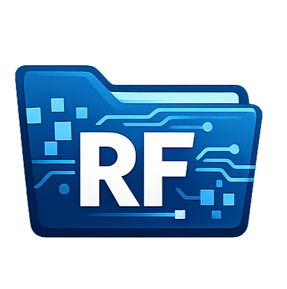
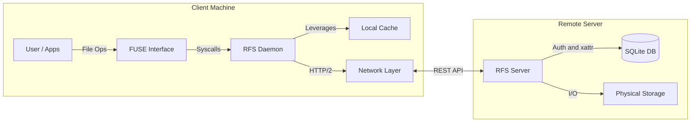

<div align="center">



# RemoteFileSystem (RFS)

[](https://www.rust-lang.org/)

[](https://github.com/apiProgramming2425remoteFileSystem/remoteFileSystem)
[-yellow?style=flat-square&logo=windows)](https://github.com/apiProgramming2425remoteFileSystem/remoteFileSystem)
[](LICENSE)

</div>

**Transparently mount remote storage as a local drive.**

## About the Project

**RemoteFileSystem (RFS)** is a file system written in Rust. It allows you to mount a remote directory on a server as a local folder on your machine.

To your operating system, `RFS` looks like a standard local drive. Under the hood, it's a sophisticated FUSE (Filesystem in Userspace) client that communicates with a RESTful backend to perform file operations in real-time.

## Key Features

- **Transparent Mounting:** Interact with remote files using standard tools (`ls`, `cp`, `vim`, Explorer).
- **Smart Caching:** Local caching layer with configurable TTL to minimize network requests.
- **Secure Authentication:** JWT-based authentication flow.
- **RESTful Backend:** Stateless server architecture that is easy to scale.
- **Resilience:** Graceful handling of network interruptions and reconnect logic.
- **Cross-Platform:**
  - **Linux:** Full FUSE support via `fuser`.
  - **Windows:** Experimental support via `WinFSP`.

---

## Architecture

The system consists of two primary components: the **Daemon Client** (which acts as the file system driver) and the **Central Server** (REST API + Storage).



---

## Getting Started

### Prerequisites

Ensure you have the following installed:

- **Rust Toolchain:** (v1.75+) `rustup update stable`
- **FUSE Dependencies:**
  - **Linux (Ubuntu/Debian):** `sudo apt install libfuse3-dev fuse3`
  - **Windows:** Install [WinFSP](https://winfsp.dev/rel/) (Required for Windows mounting)

### 🛠️ Installation & Build

Clone the repository and build both binaries:

```bash
git clone https://github.com/apiProgramming2425remoteFileSystem/remoteFileSystem.git
cd remoteFileSystem
```

You can run the application using **Docker** or build it directly **from source**.

#### Option 1: Using Docker

To build and run the entire stack (Client and Server) seamlessly, use Docker Compose:

```bash
docker compose up --build -d
```

<details>
<summary><b>Click here if you only want to build individual Docker images</b></summary>

```bash
# Build Client Image
docker build -f docker/Dockerfile.client -t remote-fs-client .

# Build Server Image
docker build -f docker/Dockerfile.server -t remote-fs-server .
```

</details>

#### Option 2: Building from Source
  
**Linux / macOS** Use the provided shell scripts to build the application:

```bash
# Build the client
chmod u+x ./scripts/unix/client/build.sh
./scripts/unix/client/build.sh

# Build the server (if applicable)
chmod u+x ./scripts/unix/server/build.sh
./scripts/unix/server/build.sh
```

**Windows** Execute the provided batch scripts, [`build.bat`](scripts/windows/client/build.bat), from your command prompt or PowerShell:

```cmd
.\scripts\windows\client\build.bat
```

## 💻 Usage (CLI)

The `remote_fs_client` binary exposes several subcommands for managing the mount lifecycle.

```text
Remote Filesystem Client

Usage: remote_fs_client_core <COMMAND>

Commands:
  run       Start the remote filesystem client
  toml-gen  Generate a default configuration file
  env-gen   Generate environment variable template
  unmount   Unmount the remote filesystem
  help      Print this message or the help of the given subcommand(s)

Options:
  -V, --version  Print version
  -h, --help     Print help
```

The `remote_fs_client` binary exposes the following subcommands.

```text
Remote Filesystem Server

Usage: server [OPTIONS] [COMMAND]

Commands:
  run                   Start the remote filesystem client
  user-create           Create user
  user-change-username  Change username
  user-change-password  Change user password
  user-delete           Delete user
  toml-gen              Generate a default configuration file
  env-gen               Generate environment variable template
  help                  Print this message or the help of the given subcommand(s)

Options:
  -d, --database-path <DATABASE_PATH>  Path to the database file [env: DATABASE_PATH=database/db.sqlite] [default: database/db.sqlite]
  -h, --help                           Print help
  -V, --version                        Print version
```

---

## Usage Guide

### 1. Server Setup

First, start the backend server that hosts the files, as **root**.

**Database Init:**
The server uses a local database for users/metadata. At first usage you need to populate the database:

```bash
remote_fs_server user-create [OPTIONS] --username <USERNAME> --password <PASSWORD>

# Create user
# Usage: remote_fs_server_core user-create [OPTIONS] --username <USERNAME> --password <PASSWORD>
# 
# Options:
#   -u, --username <USERNAME>  Username for the new user
#   -p, --password <PASSWORD>  Password for the new user
#       --uid <USER_ID>        Optional user ID for the new user If not provided, the system will assign one automatically
#       --gid <GROUP_ID>       Optional group ID for the new user If not provided, the user will be assigned to its own group
#   -h, --help                 Print help
```

**Run Server:**

```bash
# Set environment variables (Optional, defaults shown)
export RFS__SERVER_HOST=0.0.0.0
export RFS__SERVER_PORT=8080
export RFS__FILESYSTEM_ROOT="/remote_fs"

# Start
remote_fs_server run 

# Start the remote filesystem client
# 
# Usage: remote_fs_server_core run [OPTIONS]
# 
# Options:
#   -c, --config-file <CONFIG_FILE>
#           Path to the configuration file [env: RFS__CONFIG_FILE=] [default: server_config.toml]
#   -s, --server-host <SERVER_HOST>
#           Server hostname or IP to bind to [env: RFS__SERVER_HOST=]
#   -p, --server-port <SERVER_PORT>
#           Server port to listen on [env: RFS__SERVER_PORT=]
#   -f, --filesystem-root <FILESYSTEM_ROOT>
#           Root directory for the remote filesystem [env: RFS__FILESYSTEM_ROOT=]
#   -h, --help
#           Print help
#   -V, --version
#           Print version
# 
# Logging Configuration:
#       --log-targets <LOG_TARGETS>    Log targets as comma separated list [possible values: none, console, file, all]
#       --log-format <LOG_FORMAT>      Log format [possible values: full, compact, pretty, json]
#       --log-level <LOG_LEVEL>        Log level filter [possible values: trace, debug, info, warn, error]
#       --log-dir <LOG_DIR>            Optional path for log directory. Defaults to [`DEFAULT_LOG_DIR`] if needed
#       --log-file <LOG_FILE>          Optional log file name. Defaults to [`DEFAULT_LOG_FILE_NAME`] if needed
#       --log-rotation <LOG_ROTATION>  Optional log rotation policy. Defaults to [`DEFAULT_LOG_FILE_ROT`] if needed [possible values: minutely, hourly, daily, never]
```

### 2. Client Mount

Now, mount the remote storage on your local machine.

**Authentication:**
Before mounting, ensure you have a valid user created in the server database.

**Run Client:**

```bash
# Via CLI or using Environment Variables
export RFS__USERNAME="myuser"
export RFS__PASSWORD="mypassword"

remote_fs_client run

# Start the remote filesystem client
# 
# Usage: remote_fs_client_core run [OPTIONS]
# 
# Options:
#   -c, --config-file <CONFIG_FILE>  Path to the configuration file [env: RFS__CONFIG_FILE=] [default: client_config.toml]
#   -m, --mount-point <MOUNT_POINT>  Mount point path (e.g /mnt/remote-fs) [env: RFS__MOUNT_POINT=]
#   -s, --server-url <SERVER_URL>    Remote server base URL (e.g. http://localhost:8080/) [env: RFS__SERVER_URL=]
#   -f, --foreground                 Run the application in the foreground without daemonizing
#       --no-gui                     Disable GUI
#   -u, --username <USERNAME>        Optional username for authentication [env: RFS__USERNAME=]
#   -h, --help                       Print help
# 
# Mount Configuration:
#       --allow-other  Allow other users access to the mounted filesystem
#       --read-only    Mount the filesystem as read-only
#       --privileged   Mount the filesystem as privileged
# 
# Filesystem Configuration:
#       --no-xattr                      Disable xattributes
#       --fs-page-size <PAGE_SIZE>      Page size in bytes
#       --fs-max-pages <MAX_PAGES>      Maximum number of pages in memory
#       --fs-buffer-size <BUFFER_SIZE>  Buffer size for file operations in bytes
# 
# Cache Configuration:
#       --no-cache                   Disable local caching
#       --cache-capacity <CAPACITY>  Maximum number of entries in cache
#       --cache-no-ttl               Disable TTL eviction in cache
#       --cache-ttl <TTL>            TTL duration in seconds (only used if --cache-use-ttl is true)
#       --cache-policy <POLICY>      Cache eviction policy [possible values: lru, lfu]
#       --cache-max-size <MAX_SIZE>  Maximum allowed cached file size in bytes
# 
# Logging Configuration:
#       --log-targets <LOG_TARGETS>    Log targets as comma separated list [possible values: none, console, file, all]
#       --log-format <LOG_FORMAT>      Log format [possible values: full, compact, pretty, json]
#       --log-level <LOG_LEVEL>        Log level filter [possible values: trace, debug, info, warn, error]
#       --log-dir <LOG_DIR>            Optional path for log directory. Defaults to [`DEFAULT_LOG_DIR`] if needed
#       --log-file <LOG_FILE>          Optional log file name. Defaults to [`DEFAULT_LOG_FILE_NAME`] if needed
#       --log-rotation <LOG_ROTATION>  Optional log rotation policy. Defaults to [`DEFAULT_LOG_FILE_ROT`] if needed [possible values: minutely, hourly, daily, never]
```

> **Note for Windows Users:**
> Run the terminal as Administrator or ensure your user has FUSE privileges. Mount points usually look like `X:`.

---

## Configuration

The system uses a tiered configuration approach with the following hierarchy **Environment Variables** > **Configuration Files** > **Defaults**.

### Server Configuration

| Variable               | TOML Key          | Default      | Description        |
| :--------------------- | :---------------- | :----------- | :----------------- |
| `RFS__SERVER_HOST`     | `server_host`     | `localhost`  | Binding address.   |
| `RFS__SERVER_PORT`     | `server_port`     | `8080`       | Listening port.    |
| `RFS__FILESYSTEM_ROOT` | `filesystem_root` | `/remote_fs` | Storage root path. |

### Client Configuration

| Variable           | TOML Key      | Default                 | Description                      |
| :----------------- | :------------ | :---------------------- | :------------------------------- |
| `RFS__SERVER_URL`  | `server_url`  | `http://localhost:8080` | Backend endpoint.                |
| `RFS__MOUNT_POINT` | `mount_point` | `/mnt/remote-fs`        | Local mount directory.           |
| `RFS__CACHE_TTL`   | `cache_ttl`   | `300`                   | Implementation specific TTL (s). |

---

## License

Distributed under the **MIT** License. See [`LICENSE`](LICENSE) for more information.
